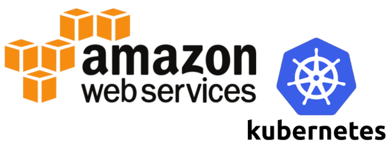

<p align="center">
   </image>
</p>

# Getting Started

## Install kops

Before we can bring up the cluster we need to [install the CLI tool](install.md) `kops`.

## Install kubectl

In order to control Kubernetes clusters we need to [install the CLI tool](install.md) `kubectl`.

#### Other Platforms

* [Kubernetes Latest Release](https://github.com/kubernetes/kubernetes/releases/latest)

* [Installation Guide](http://kubernetes.io/docs/user-guide/prereqs/)

## Setup your environment

### AWS

In order to correctly prepare your AWS account for `kops`, we require you to
install the AWS CLI tools, and have API credentials for an account that has
the permissions to create a new IAM account for `kops` later in the guide.


Once you've [installed the AWS CLI tools](install.md) and have correctly setup
your system to use the official AWS methods of registering security credentials
as [defined here](https://docs.aws.amazon.com/sdk-for-go/v1/developer-guide/configuring-sdk.html#specifying-credentials) we'll be ready to run `kops`, as it uses the Go AWS SDK.

#### Setup IAM user

In order to build clusters within AWS we'll create a dedicated IAM user for
`kops`.  This user requires API credentials in order to use `kops`.  Create
the user, and credentials, using the [AWS console](http://docs.aws.amazon.com/IAM/latest/UserGuide/id_users_create.html#id_users_create_console).

The `kops` user will require the following IAM permissions to function properly:

```
AmazonEC2FullAccess
AmazonRoute53FullAccess
AmazonS3FullAccess
IAMFullAccess
AmazonVPCFullAccess
```

You can create the kops IAM user from the command line using the following:

```bash
aws iam create-group --group-name kops

aws iam attach-group-policy --policy-arn arn:aws:iam::aws:policy/AmazonEC2FullAccess --group-name kops
aws iam attach-group-policy --policy-arn arn:aws:iam::aws:policy/AmazonRoute53FullAccess --group-name kops
aws iam attach-group-policy --policy-arn arn:aws:iam::aws:policy/AmazonS3FullAccess --group-name kops
aws iam attach-group-policy --policy-arn arn:aws:iam::aws:policy/IAMFullAccess --group-name kops
aws iam attach-group-policy --policy-arn arn:aws:iam::aws:policy/AmazonVPCFullAccess --group-name kops

aws iam create-user --user-name kops

aws iam add-user-to-group --user-name kops --group-name kops

aws iam create-access-key --user-name kops
```

You should record the SecretAccessKey and AccessKeyID in the returned JSON
output, and then use them below:

```bash
# configure the aws client to use your new IAM user
aws configure           # Use your new access and secret key here
aws iam list-users      # you should see a list of all your IAM users here

# Because "aws configure" doesn't export these vars for kops to use, we export them now
export AWS_ACCESS_KEY_ID=$(aws configure get aws_access_key_id)
export AWS_SECRET_ACCESS_KEY=$(aws configure get aws_secret_access_key)
```

## Configure DNS

Note: If you are using Kops 1.6.2 or later, then DNS configuration is
optional. Instead, a gossip-based cluster can be easily created. The
only requirement to trigger this is to have the cluster name end with
`.k8s.local`. If a gossip-based cluster is created then you can skip
this section.

In order to build a Kubernetes cluster with `kops`, we need to prepare
somewhere to build the required DNS records.  There are three scenarios
below and you should choose the one that most closely matches your AWS
situation.

### Scenario 1a: A Domain purchased/hosted via AWS

If you bought your domain with AWS, then you should already have a hosted zone
in Route53.  If you plan to use this domain then no more work is needed.

In this example you own `example.com` and your records for Kubernetes would
look like `etcd-us-east-1c.internal.clustername.example.com`

### Scenario 1b: A subdomain under a domain purchased/hosted via AWS

In this scenario you want to contain all kubernetes records under a subdomain
of a domain you host in Route53.  This requires creating a second hosted zone
in route53, and then setting up route delegation to the new zone.

In this example you own `example.com` and your records for Kubernetes would
look like `etcd-us-east-1c.internal.clustername.subdomain.example.com`

This is copying the NS servers of your **SUBDOMAIN** up to the **PARENT**
domain in Route53.  To do this you should:

* Create the subdomain, and note your **SUBDOMAIN** name servers (If you have
  already done this you can also [get the values](ns.md))

```bash
# Note: This example assumes you have jq installed locally.
ID=$(uuidgen) && aws route53 create-hosted-zone --name subdomain.example.com --caller-reference $ID | \
    jq .DelegationSet.NameServers
```

* Note your **PARENT** hosted zone id

```bash
# Note: This example assumes you have jq installed locally.
aws route53 list-hosted-zones | jq '.HostedZones[] | select(.Name=="example.com.") | .Id'
```

* Create a new JSON file with your values (`subdomain.json`)

Note: The NS values here are for the **SUBDOMAIN**

```
{
  "Comment": "Create a subdomain NS record in the parent domain",
  "Changes": [
    {
      "Action": "CREATE",
      "ResourceRecordSet": {
        "Name": "subdomain.example.com",
        "Type": "NS",
        "TTL": 300,
        "ResourceRecords": [
          {
            "Value": "ns-1.awsdns-1.co.uk"
          },
          {
            "Value": "ns-2.awsdns-2.org"
          },
          {
            "Value": "ns-3.awsdns-3.com"
          },
          {
            "Value": "ns-4.awsdns-4.net"
          }
        ]
      }
    }
  ]
}
```

* Apply the **SUBDOMAIN** NS records to the **PARENT** hosted zone.

```
aws route53 change-resource-record-sets \
 --hosted-zone-id <parent-zone-id> \
 --change-batch file://subdomain.json
```

Now traffic to `*.subdomain.example.com` will be routed to the correct subdomain hosted zone in Route53.

### Scenario 2: Setting up Route53 for a domain purchased with another registrar

If you bought your domain elsewhere, and would like to dedicate the entire domain to AWS you should follow the guide [here](http://docs.aws.amazon.com/Route53/latest/DeveloperGuide/domain-transfer-to-route-53.html)

### Scenario 3: Subdomain for clusters in route53, leaving the domain at another registrar

If you bought your domain elsewhere, but **only want to use a subdomain in AWS
Route53** you must modify your registrar's NS (NameServer) records.  We'll create
a hosted zone in Route53, and then migrate the subdomain's NS records to your
other registrar.

You might need to grab [jq](https://github.com/stedolan/jq/wiki/Installation)
for some of these instructions.

* Create the subdomain, and note your name servers (If you have already done
  this you can also [get the values](ns.md))

```bash
ID=$(uuidgen) && aws route53 create-hosted-zone --name subdomain.example.com --caller-reference $ID | jq .DelegationSet.NameServers
```

* You will now go to your registrar's page and log in. You will need to create a
  new **SUBDOMAIN**, and use the 4 NS records received from the above command for the new
  **SUBDOMAIN**. This **MUST** be done in order to use your cluster. Do **NOT**
  change your top level NS record, or you might take your site offline.

* Information on adding NS records with
  [Godaddy.com](https://www.godaddy.com/help/set-custom-nameservers-for-domains-registered-with-godaddy-12317)
* Information on adding NS records with [Google Cloud
  Platform](https://cloud.google.com/dns/update-name-servers)

#### Using Public/Private DNS (Kops 1.5+)

By default the assumption is that NS records are publicly available.  If you
require private DNS records you should modify the commands we run later in this
guide to include:

```
kops create cluster --dns private $NAME
```

If you have a mix of public and private zones, you will also need to include the `--dns-zone` argument with the hosted zone id you wish to deploy in:

```
kops create cluster --dns private --dns-zone ZABCDEFG $NAME
```

## Testing your DNS setup

This section is not be required if a gossip-based cluster is created.

You should now able to dig your domain (or subdomain) and see the AWS Name
Servers on the other end.

```bash
dig ns subdomain.example.com
```

Should return something similar to:

```
;; ANSWER SECTION:
subdomain.example.com.        172800  IN  NS  ns-1.awsdns-1.net.
subdomain.example.com.        172800  IN  NS  ns-2.awsdns-2.org.
subdomain.example.com.        172800  IN  NS  ns-3.awsdns-3.com.
subdomain.example.com.        172800  IN  NS  ns-4.awsdns-4.co.uk.
```

This is a critical component of setting up clusters. If you are experiencing
problems with the Kubernetes API not coming up, chances are something is wrong
with the cluster's DNS.

**Please DO NOT MOVE ON until you have validated your NS records! This is not required if a gossip-based cluster is created.**

## Cluster State storage

In order to store the state of your cluster, and the representation of your
cluster, we need to create a dedicated S3 bucket for `kops` to use.  This
bucket will become the source of truth for our cluster configuration.  In
this guide we'll call this bucket `example-com-state-store`, but you should
add a custom prefix as bucket names need to be unique.

We recommend keeping the creation of this bucket confined to us-east-1,
otherwise more work will be required.

```bash
aws s3api create-bucket \
    --bucket prefix-example-com-state-store \
    --region us-east-1
```

Note: S3 requires `--create-bucket-configuration LocationConstraint=<region>` for regions other than `us-east-1`.

Note: We **STRONGLY** recommend versioning your S3 bucket in case you ever need
to revert or recover a previous state store.

```bash
aws s3api put-bucket-versioning --bucket prefix-example-com-state-store  --versioning-configuration Status=Enabled
```

Information regarding cluster state store location must be set when using `kops` cli see [state store](state.md) for further information.

### Using S3 default bucket encryption

kops supports [default bucket encryption](https://aws.amazon.com/de/blogs/aws/new-amazon-s3-encryption-security-features/) to encrypt the kops state in an S3 bucket. In this way, whatever default server side encryption is set for your bucket, it will be used for the kops state, too. You may want to use this AWS feature e.g. for easily encrypting every written object by default or when for compliance reasons you need to use specific encryption keys (KMS, CMK).

If your S3 bucket has a default encryption set up, kops will use it:

```bash
aws s3api put-bucket-encryption --bucket prefix-example-com-state-store --server-side-encryption-configuration '{"Rules":[{"ApplyServerSideEncryptionByDefault":{"SSEAlgorithm":"AES256"}}]}'
```

If the default encryption is not set or it cannot be checked, kops will resort to using client side AES256 encryption.
 
### Sharing an S3 bucket across multiple accounts

It is possible to use a single S3 bucket for storing kops state for clusters
located in different accounts, by using [cross-account bucket policies](http://docs.aws.amazon.com/AmazonS3/latest/dev/example-walkthroughs-managing-access-example2.html#access-policies-walkthrough-cross-account-permissions-acctA-tasks).

Kops will be able to use buckets configured with cross-account policies by default.

In this case you may want to override the object ACLs which kops places on the
state files, as default AWS ACLs will make it possible for an account that has
delegated access to write files that the bucket owner can not read.

To do this you should set the environment variable `KOPS_STATE_S3_ACL` to the
preferred object ACL, for example `bucket-owner-full-control`.

For available canned ACLs please consult [Amazon's S3
documentation](http://docs.aws.amazon.com/AmazonS3/latest/dev/acl-overview.html#canned-acl).

# Creating your first cluster

## Prepare local environment

We're ready to start creating our first cluster!  Let's first set up a few
environment variables to make this process easier.

```bash
export NAME=myfirstcluster.example.com
export KOPS_STATE_STORE=s3://prefix-example-com-state-store
```

For a gossip-based cluster, make sure the name ends with `k8s.local`. For example:

```bash
export NAME=myfirstcluster.k8s.local
export KOPS_STATE_STORE=s3://prefix-example-com-state-store
```

Note: You don’t have to use environmental variables here. You can always define
the values using the –name and –state flags later.

## Create cluster configuration

We will need to note which availability zones are available to us. In this
example we will be deploying our cluster to the us-west-2 region.

```bash
aws ec2 describe-availability-zones --region us-west-2
```

Below is a create cluster command.  We'll use the most basic example possible,
with more verbose examples in [high availability](high_availability.md#advanced-example).
The below command will generate a cluster configuration, but not start building
it. Make sure that you have generated SSH key pair before creating the cluster.

```bash
kops create cluster \
    --zones us-west-2a \
    ${NAME}
```

All instances created by `kops` will be built within ASG (Auto Scaling Groups),
which means each instance will be automatically monitored and rebuilt by AWS if
it suffers any failure.

## Customize Cluster Configuration

Now we have a cluster configuration, we can look at every aspect that defines
our cluster by editing the description.

```bash
kops edit cluster ${NAME}
```

This opens your editor (as defined by $EDITOR) and allows you to edit the
configuration.  The configuration is loaded from the S3 bucket we created
earlier, and automatically updated when we save and exit the editor.

We'll leave everything set to the defaults for now, but the rest of the `kops`
documentation covers additional settings and configuration you can enable.

## Build the Cluster

Now we take the final step of actually building the cluster.  This'll take a
while.  Once it finishes you'll have to wait longer while the booted instances
finish downloading Kubernetes components and reach a "ready" state.

```bash
kops update cluster ${NAME} --yes
```

## Use the Cluster

Remember when you installed `kubectl` earlier? The configuration for your
cluster was automatically generated and written to `~/.kube/config` for you!

A simple Kubernetes API call can be used to check if the API is online and
listening. Let's use `kubectl` to check the nodes.

```bash
kubectl get nodes
```

You will see a list of nodes that should match the `--zones` flag defined
earlier. This is a great sign that your Kubernetes cluster is online and
working.

Also `kops` ships with a handy validation tool that can be ran to ensure your
cluster is working as expected.

```bash
kops validate cluster
```

You can look at all the system components with the following command.

```
kubectl -n kube-system get po
```

## Delete the Cluster

Running a Kubernetes cluster within AWS obviously costs money, and so you may
want to delete your cluster if you are finished running experiments.

You can preview all of the AWS resources that will be destroyed when the cluster
is deleted by issuing the following command.

```
kops delete cluster --name ${NAME}
```

When you are sure you want to delete your cluster, issue the delete command
with the `--yes` flag. Note that this command is very destructive, and will
delete your cluster and everything contained within it!

```
kops delete cluster --name ${NAME} --yes
```

# What's next?

We've barely scratched the surface of the capabilities of `kops` in this guide,
and we recommend researching [other interesting
modes](commands.md#other-interesting-modes) to learn more about generating
Terraform configurations, or running your cluster in an HA (Highly Available)
mode.

The [cluster spec docs](cluster_spec.md) can help to configure these "other
interesting modes". Also be sure to check out how to run a [private network
topology](topology.md) in AWS.

## Feedback

There's an incredible team behind Kops and we encourage you to reach out to the
community on the Kubernetes
Slack(http://slack.k8s.io/).  Bring your
questions, comments, and requests and meet the people behind the project!

## Legal

*AWS Trademark used with limited permission under the [AWS Trademark
Guidelines](https://aws.amazon.com/trademark-guidelines/)*

*Kubernetes Logo used with permission under the [Kubernetes Branding
Guidelines](https://github.com/kubernetes/kubernetes/blob/master/logo/usage_guidelines.md)*
