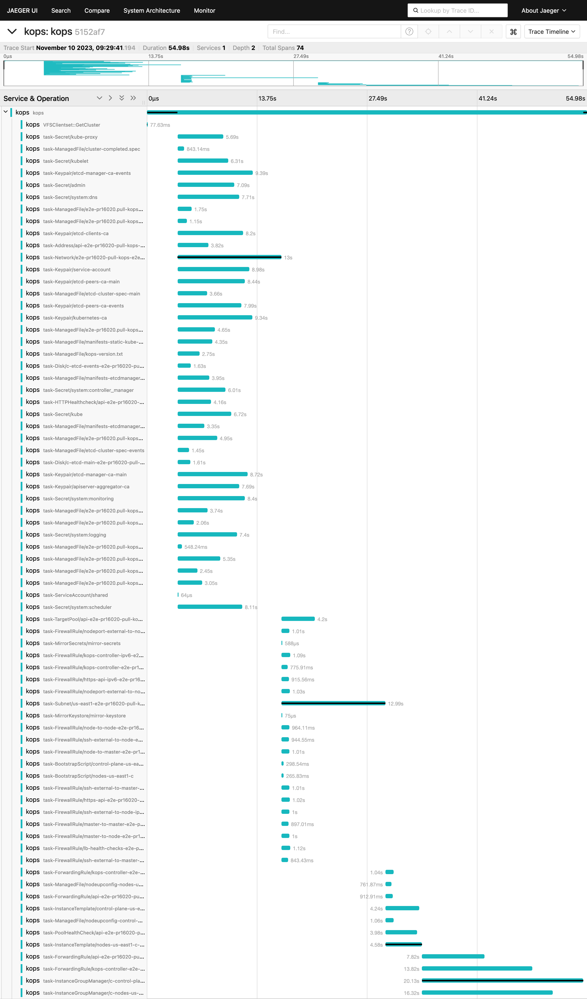

# OpenTelemetry support

kOps is experimenting with initial support for OpenTelemetry, starting with tracing.

The support should be considered experimental; the trace file format and schema will likely change, and these initial experiments might be removed entirely.

kOps supports a "serverless" mode of operation, where it logs the OpenTracing output to a file.  We do this because our e2e test runner (prow) doesn't yet have a destination for OpenTelemetry data.

To try this out:

`OTEL_EXPORTER_OTLP_TRACES_FILE=/tmp/trace go run ./cmd/kops get cluster`

You should now see that the /tmp/trace file is created.

Then we have an experimental tool to serve the trace file to jaeger. First ensure `jaeger-query` is in your PATH, available [here](https://www.jaegertracing.io/download/#binaries)

```
cd tools/otel/traceserver
go run . --src /tmp/trace --run jaeger
```

Alternatively you can use the jaeger docker image with:

```
go run . --src /tmp/trace --run docker-jaeger
```

This will open your local jaeger-query's frontend in a web browser:



Not everything is instrumented yet, and not all the traces are fully joined up (we need to thread more contexts through more methods),
but you should be able to start to explore the operations that we run and their performance.

## Prow Jobs

Tracing is enabled in the kops prow jobs. `.otel` files are created during job execution and included as job artifacts in the `otlp` subdirectory.

Example:

```
https://gcsweb.k8s.io/gcs/kubernetes-jenkins/pr-logs/pull/kops/16204/presubmit-kops-aws-scale-amazonvpc-using-cl2/1742962895290896384/artifacts/otlp/
```

Download these files to a local directory, either with `gsutil` or through a web browser

```
mkdir /tmp/job-traces

gsutil cp -r gs://kubernetes-jenkins/pr-logs/pull/kops/16204/presubmit-kops-aws-scale-amazonvpc-using-cl2/1742962895290896384/artifacts/otlp/ /tmp/job-traces
```

Then run the trace server as normal:

```sh
cd tools/otel/traceserver
go run . --src /tmp/traces --run jaeger
```