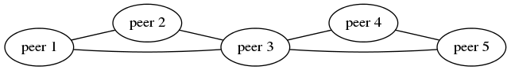

A Weave network consists of a number of 'peers' - Weave Net routers
residing on different hosts. Each peer has a name, which tends to
remain the same over restarts, a human friendly nickname for use in
status and logging output and a unique identifier (UID) that is
different each time it is run.  These are opaque identifiers as far as
the router is concerned, although the name defaults to a MAC address.

Weave Net routers establish TCP connections with each other, over which they
perform a protocol handshake and subsequently exchange
[topology](/site/router-topology/network-topology.md) information. 
These connections are encrypted if
so configured. Peers also establish UDP "connections", possibly
encrypted, which carry encapsulated network packets. These
"connections" are duplex and can traverse firewalls.

Weave Net creates a network bridge on the host. Each container is
connected to that bridge via a veth pair, the container side of which
is given an IP address and netmask supplied either by the user or
by Weave Net's IP address allocator.

Weave Net routes packets between containers on different hosts via two
methods: a [fast data path](/site/using-weave/fastdp.md) method, which operates
entirely in kernel space, and a fallback `sleeve` method, in which
packets destined for non-local containers are captured by the kernel
and processed by the Weave Net router in user space, forwarded over
UDP to weave router peers running on other hosts, and there injected
back into the kernel which in turn passes them to local destination
containers.

Weave Net routers learn which peer host a particular MAC address resides
on. They combine this knowledge with topology information in order to
make routing decisions and thus avoid forwarding every packet to every
peer. Weave Net can route packets in partially connected networks with
changing topology. For example, in this network, peer 1 is connected
directly to 2 and 3, but if 1 needs to send a packet to 4 or 5 it must
first send it to peer 3:

**See Also**

 * [Weave Router Sleeve Encapsulation](/site/how-it-works/router-encapsulation.md)
 * [How Weave Interprets Network Topology](/site/how-it-works/network-topology.md)
