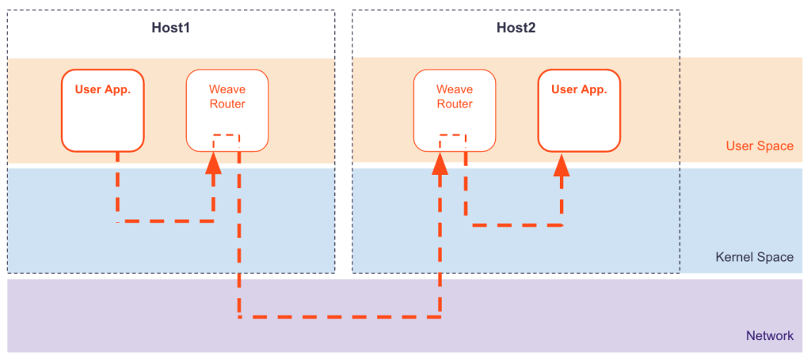
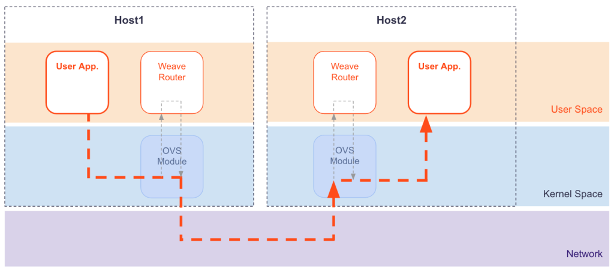
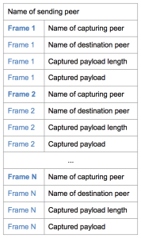

Weave Net implements an overlay network between Docker hosts. Without fast datapath enabled, each packet is encapsulated in a tunnel protocol header and sent to the destination host, where the header is removed.  The Weave router is a user space process, which means that the packet follows a winding path in and out of the Linux kernel:

The fast datapath in Weave Net uses the Linux kernel's [Open vSwitch datapath module](https://www.kernel.org/doc/Documentation/networking/openvswitch.txt). This module enables the Weave Net router to tell the kernel how to process packets:

Because Weave Net issues instructions directly to the kernel, context switches are decreased, and so by using `fast datapath` CPU overhead and latency is reduced. The packet goes straight from your application to the kernel, where the Virtual Extensible Lan (VXLAN) header is added (the NIC does this if it offers VXLAN acceleration). VXLAN is an IETF standard UDP-based tunneling protocol that enable you to use common networking tools like [Wireshark](https://www.wireshark.org/) to inspect the tunneled packets.

Prior to version 1.2, Weave Net used a custom encapsulation format. Fast datapath uses VXLAN, and like Weave Net's custom encapsulation format, VXLAN is UDP-based, and therefore needs no special configuration with network infrastructure. 

>**Note:** The required open vSwitch datapath (ODP) and VXLAN features are present in Linux kernel versions 3.12 and greater. If your kernel was built without the necessary modules Weave Net will fall back to the "user mode" packet path.

**See Also**

 * [Using Weave Net](/site/using-weave.md)
 * [Using Fast Datapath](/site/using-weave/fastdp.md)

