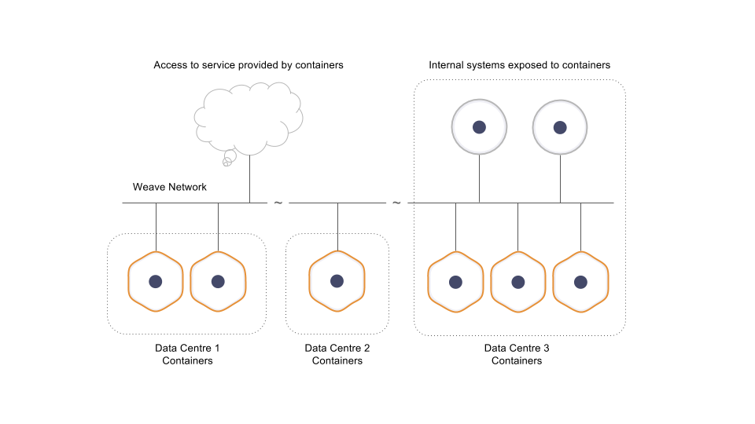

Weave Net creates a virtual network that connects Docker containers across multiple hosts and enables their automatic discovery. With Weave Net, portable microservices-based applications consisting of multiple containers can run anywhere: on one host, multiple hosts or even across cloud providers and data centers. Applications use the network just as if the containers were all plugged into the same network switch, without having to configure port mappings, ambassadors or links.

Services provided by application containers on the weave network can be exposed to the outside world, regardless of where they are running. Similarly, existing internal systems can be opened to accept connections from application containers irrespective of their location.

## Why Weave?

### Hassle Free Configuration

Weave Net simplifies setting up a container network. Because containers on a Weave network use standard port numbers, (for example MySQL’s default is port 3306), managing microservices is straightforward. Every container can find the IP of any other container using a simple DNS query on the container's name, and it can also communicate directly without NAT, without using port mappings or complicated ambassador linking.  And best of all deploying a Weave container network requires zero changes to your application’s code. 

### Service Discovery

Weave Net implements service discovery by providing a fast "micro DNS" server at each node. You simply name containers and everything 'just works', including load balancing across multiple containers with the same name.  

### No External Cluster Store Required

All other Docker networking plugins, including Docker's own "Overlay" driver, require that you set up Docker with a cluster store – a central database like Consul or Zookeeper – before you can even use them. Besides being difficult to set up, maintain and manage, every Docker host must also be in constant contact with the cluster store: if you lose the connection, even temporarily, then you cannot start or stop any containers.

Weave Net is bundled with a Docker Network plugin that doesn't require an external cluster store. You can get started right away and you can start and stop containers even when there are network connectivity problems.  
For information about the Weave Docker Plugin, see [How The Weave Network Plugin Works](/site/plugin/plugin-how-it-works.md).

### Operates in Partially Connected Networks

Weave Net can forward traffic between nodes, and it works even if the mesh network is only partially connected.  This means that you can have a mix of legacy systems and containerized apps and still use Weave Net to keep everything in communication. 

### Weave Net is Fast

Weave Net automatically chooses the fastest path between two hosts, offering near native throughput and latency, all without your intervention.  

See [How Fast Datapath Works](/site/using-weave/fastdp.md) for more information.

### Network Operations Friendly

Weave uses industry-standard VXLAN encapsulation between hosts. This means you can continue using your favorite packet analyzing tools, such as ‘Wireshark’ to inspect and troubleshoot protocols.

### Weave Net is Secure

Weave Net traverses firewalls without requiring a TCP add-on. You can encrypt your traffic, which allows you to connect to apps on hosts even across an untrusted network.  

### Multicast Support

Multicast addressing and routing is fully supported in Weave Net. Data can be sent to one multicast address and it will be automatically broadcast to all of its recipients. 

### NAT Traversal

With Weave Net, deploy your applications - whether peer-to-peer file sharing, voice over IP or anything else - and take advantage of built-in NAT traversal. With Weave your app is portable, containerized and with its standardized approach to networking it gives you one less thing to worry about.

### Run with Anything: Kubernetes, Mesos, Amazon ECS, ...

Weave Net is a good choice if you want one tool for everything.  For example: In addition to Docker plugins, you can also use Weave as a Kubernetes plugin.  You can also use Weave with Amazon ECS or with Mesos and Marathon.  
Refer to our Getting Started and Integration Guides for more information.

For a complete list and description of Weave Net’s current feature set see, [Weave Net Features](/site/features.md).

