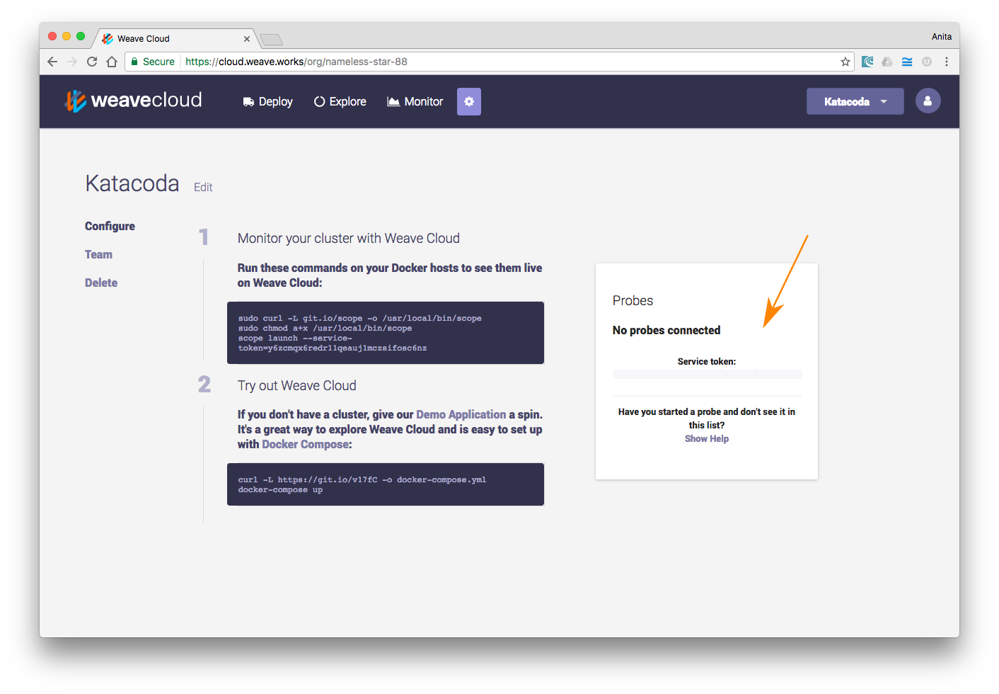

Weave Net provides a simple to deploy networking solution for containerized apps. Here, we describe how to manage a Weave container network using a sample application which consists of two simple `netcat` services deployed to containers on two separate hosts.

This section contains the following topics:

 * [Signing in to Weave Cloud](#signing-in)
 * [Launching Weave Net](#launching)
 * [Launching on Additional Hosts](#peer-connections)
 * [How Peer Discovery Works](#how-it-works)

### <a name="signing-in"></a>Signing in to Weave Cloud

Weave Cloud is a fast and simple way to visualize, manage and monitor
containers and microservices.  In order to use Weave Cloud to set up
Weave Net, you must sign up to Weave Cloud and create an "Instance".

The instance will have a Service Token which is a 32-character string
used to uniquely identify it.  Get hold of the Service Token for your
Instance, as shown below:



For the purpose of these instructions we will use a dummy Service
Token `dk6hz1acdd58aea6b75migoy4axqasdf`.


### <a name="launching"></a>Launching Weave Net

Before launching Weave Net and deploying your apps, ensure that Docker
is [installed](https://docs.docker.com/engine/installation/) on both
hosts.

On `$HOST1` run:

    host1$ weave launch --token=dk6hz1acdd58aea6b75migoy4axqasdf
    host1$ eval $(weave env)
    host1$ docker run --name a1 -ti weaveworks/ubuntu

Where,

 * The first line runs Weave Net.

* The second line configures the Weave Net environment, so that containers launched via the Docker command line are automatically attached to the Weave network, and,
 * The third line runs the [application container](/site/faq.md#own-image) using [a Docker command](https://docs.docker.com/engine/reference/run/).

> **Note** If the first command results in an error like
> ```
> Cannot connect to the Docker daemon. Is the docker daemon running on this host?
> ```
> then you likely need to be 'root' in order to connect to the Docker
> daemon. If so, run the above and all subsequent commands in a
> *single* root shell:
> ```
> host1$ sudo -s
> host1# weave launch --token=dk6hz1acdd58aea6b75migoy4axqasdf
> host1# eval $(weave env)
> host1# docker run --name a1 -ti weaveworks/ubuntu
> ```
> Do *not* prefix individual commands with `sudo`, since some commands
> modify environment entries and hence they all need to be executed from
> the same shell.

Weave Net must be launched once per host. The relevant container images will be pulled down from Docker Hub on demand during `weave launch`.

You can also preload the images by running `weave setup`. Preloaded images are useful for automated deployments, and ensure there are no delays during later operations.

If you are deploying an application that consists of more than one container to the same host, launch them one after another using `docker run`, as appropriate.  


### <a name="peer-connections"></a>Launching on Additional Hosts

To launch Weave Net on an additional host and create a peer
connection, run exactly the same commands as on the first host:

    host2$ weave launch --token=dk6hz1acdd58aea6b75migoy4axqasdf
    host2$ eval $(weave env)
    host2$ docker run --name a2 -ti weaveworks/ubuntu

Because you are using Weave Cloud, the second peer will discover the
first and automatically create a connection to it.

>**Note:** If there is a firewall between `$HOST1` and `$HOST2`,  you must permit traffic to flow through TCP 6783 and UDP 6783/6784, which are Weave’s control and data ports.

Now you can proceed to [test container communications](site/using-weave#testing)

### <a name="how-it-works"></a>How Peer Discovery Works

The Weave Cloud back-end maintains a database of all the peers that
have registered in each instance. You can create as many instances as
you like in the Weave Cloud console: for different projects, or to
separate test and production.

As each peer starts up, it looks for all network instances that
another peer might be able to contact it on, and registers those with the back-end.
If you want to control which addresses are used, add the `--advertise-address` flag:

    host1$ weave launch --token=dk6hz1acdd58aea6b75migoy4axqasdf --advertise-address=192.0.2.1,198.51.100.4

When the new peer registers itself, it also fetches a list of all
other peers in the instance, and begins to contact them.

If the peer cannot contact the Weave Cloud back-end it will print an
error message in its log and exit. To check the logs run:

    host1$ docker logs weave

When a Weave Net instance is formed for the first time, the peers must
initialize the [IP Allocation Manager](site/ipam.md). This process,
and the configuration options available, are unchanged when using
Weave Cloud.

When you shut down a peer for good, use [the `weave reset`
command](site/ipam/stop-remove-peers-ipam.md) and it will be removed
from the Weave Cloud database so future peers will not attempt to
connect to it.

**See Also**

 * [Installing Weave Net](/site/installing-weave.md)
 * [Using Weave Net](/site/using-weave.md)
 * [Using Fastdp With Weave Net](/site/using-weave/fastdp.md)
 * [Using the Weave Net Docker Network Plugin](/site/plugin.md)
